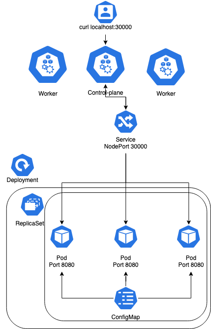

# Ultimate K8S Deployment Guide

Ultimate K8s Deployment Guide is a collection of best practices for deploying applications on Kubernetes. It is a living document that is updated regularly. Check out [blog post](https://www.fatihkoc.net/posts/helm-deployment-guide/) for more details.

## Diagram



## Prerequisites:

 - [Check blog post](https://www.fatihkoc.net/posts/helm-deployment-guide)
 - [Docker](https://docs.docker.com/engine/install/ubuntu/)
 - [Kind](https://kind.sigs.k8s.io/docs/user/quick-start/#installation)
 - [Helm](https://helm.sh/docs/intro/install/)

## Create infrastructure

Clone repository

```bash
git clone https://github.com/fatihkc/ultimate-k8s-deployment-guide.git
cd ultimate-k8s-deployment-guide
```

Create a cluster

```bash
kind create cluster --config kind/cluster.yaml --name guide --image=kindest/node:v1.23.6
```

Install Helm Chart

```bash
helm upgrade --install webserver helm-chart -f helm-chart/values.yaml -n $NAMESPACE
```

## TODO

- Add more complex examples
- Persistent volume
- Sidecar
- Multiple containers
- HPA
- Ingress

## LICENSE

[MIT License](https://choosealicense.com/licenses/mit/)